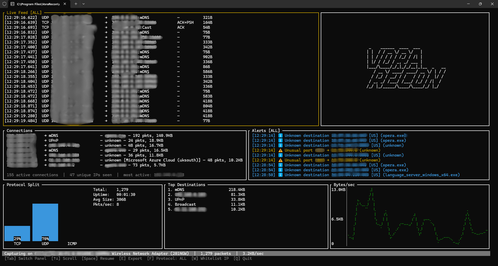

# VORA-Recon

**Vora-Recon is a packet sniffer that operates as a native terminal application, geolocating your packets and having the ability to identify which process owns each packet, enabling you to find suspicious behavior without having to use Wireshark to investigate.**



## Features

- **Real-time TUI Dashboard**: A very dense user interface built using ratatui, that will present you with a wealth of information, in real time.
- **Process Identification**: Each incoming and outgoing packet is automatically associated with the specific Windows process (PID and process name) that owns the connection.
- **GeoIP Forensics**: Geolocation of remote IP addresses immediately allows you to identify any international traffic that you find suspicious.
- **Smart Alerts**: An alert system is built in that includes rules that will alert you to abnormal connection activity, pings from the outside, and system noise.
- **JSON Logging**: All logs are machine readable (JSON) so that they can be used for later analysis, and they will be stored locally on your machine persistently.
- **Zero Configuration Optimization**: Includes the ability to set up Windows for optimal high-speed packet capture with a single click via PowerShell.

## Installation

### Prerequisites
1. **Npcap**: Required for raw packet capture on Windows. [Get it here](https://npcap.com/#download).
2. **Windows Terminal**: This is recommended if you wish to get the most out of working with the TUI.

### Quick Start
1. Download **`VORA-Recon-Setup.exe`** from the [Releases](https://github.com/sam-cre/VORA-Recon/releases) page.
2. Run the installer (**Requires Administrator Privileges**).
3. Launch **VORA-Recon** from the desktop shortcut or Start Menu.

## Global Keybinds

| `Q` | **Quit** the application immediately |
| `P` | **Pause/Resume** the live feed |
| `F` | **Cycle Filters** (Live Feed: TCP/UDP/ICMP | Alerts: Suspicious/External/Noise) |
| `C` | **Clear Alerts** log |
| `E` | **Export Report** to a text file |
| `W` | **Whitelist IP** address manually |
| `Tab` | Switch between Live Feed and Alerts panel |
| `Up/Down`| Scroll through the packet history |

## Building from Source

If you prefer to build VORA-Recon yourself:

1.  Clone the repository:
    ```powershell
    git clone https://github.com/sam-cre/VORA-Recon.git
    cd VORA-Recon
    ```
2.  Run the optimization script to configure your environment:
    ```powershell
    .\Optimize-Vora.ps1
    ```
3.  Build using Cargo:
    ```powershell
    cargo build --release
    ```

## License

Distributed under the **MIT License**. See `LICENSE` for more  Rogerstion.

---
*Created ProjectRogers — Part of the VORA Project.*
