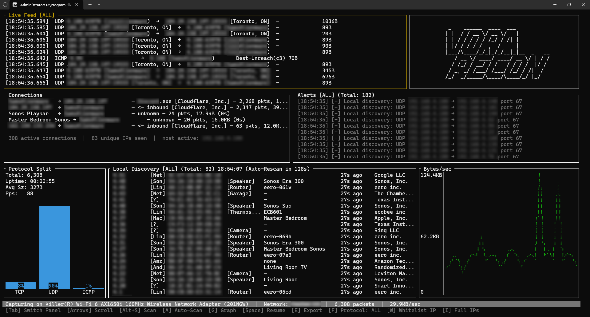
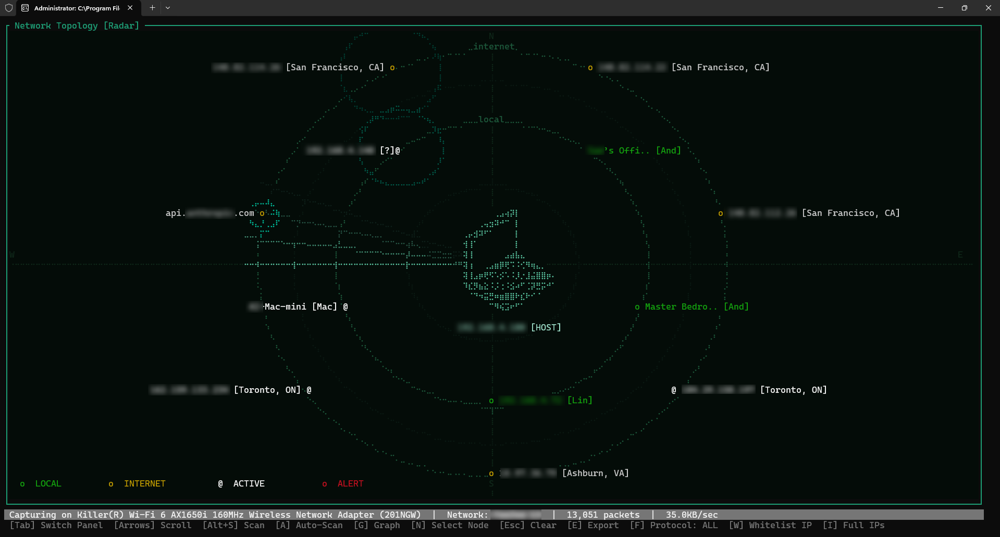

# VORA-Recon

**A network reconnaissance and packet analysis tool built as a TUI. VORA monitors every device on your LAN, geolocates external connections, identifies which process owns each packet, and alerts you to suspicious behavior purely within the terminal.**





> Windows only · Requires Administrator · Requires [Npcap](https://npcap.com/#download)

---

## Features

### Live Packet Feed
Every packet that flows through your router: protocol, source, destination, GeoIP location, size, and the process that owns the connection is decoded and displayed. Filter by TCP / UDP / ICMP connections.

### Local Network Discovery
Press `Alt+S` to scan your LAN. VORA uses a multi step procedure to find and identify every device:
- **ARP sweep** — discovers all reachable hosts on every subnet
- **mDNS / DNS-SD** — resolves Apple, Sonos, Chromecast, and HomeKit device names passively and via targeted queries
- **SSDP / UPnP** — extracts hostnames, model numbers, and firmware from smart TVs, Roku, routers, and Sonos speakers
- **WS-Discovery** — finds Windows PCs, printers, and NAS devices by name
- **NetBIOS** — resolves legacy Windows hostnames
- **HTTP banner scan** — pulls web UI titles and Server headers from device management ports
- **DHCP Option 12** — captures device hostnames directly from DHCP requests as they happen

### Device Categories
Every discovered device is automatically tagged with a category based on its vendor, hostname, and service fingerprint:

`[Router]` `[Camera]` `[Speaker]` `[TV]` `[Thermostat]` `[Hub]` `[Garage]` `[Phone]` `[PC]` `[Console]` `[Streamer]` `[Echo]` `[SmartPlug]` `[Sprinkler]` `[Appliance]` `[IoT]`

### Baseline Delta
After each scan, VORA saves a baseline of known devices for your network. On the next scan, any device not seen before is marked **[NEW]** in green so you immediately know when an unfamiliar device joins your network.

### Network Topology Radar
Press `G` to switch to a radar topology view showing your local devices orbiting the host machine, with active external connections on the outward ring.

### Process Identification
Each connection is traced back to the Windows process (full executable path) that owns it — so you can see exactly which app is talking to which server.

### GeoIP Forensics
All external IPs are resolved to country, city, region, and ISP/org via ip-api.com. International traffic is immediately visible in both the live feed and the topology radar.

### Smart Alerts
Built-in detection rules fire on:
- Unsolicited inbound connections
- External probes and port scans
- Duplicate MAC addresses on the LAN
- New devices detected since the last baseline
- ICMP activity from unusual sources

Alerts are tiered: **Suspicious** / **Behavioral** / **External** / **Noise** — filterable independently.

### Session Reports
Press `E` to export a full session report as a text file. Reports include the complete device inventory with categories, baseline delta, traffic statistics, top external destinations, active connections, resolved domains, and the full alert log.

### OS Fingerprinting
Passive fingerprinting from TCP TTL, window size, DHCP Option 55 (Parameter Request List), and JA4-style TLS ClientHello signatures to tag devices as `[Win]` `[Lin]` `[Mac]` `[And]` `[iOS]` etc.

---

## Installation

### Prerequisites
- **Windows Terminal** — strongly recommended for the best TUI experience.
- **[Npcap](https://npcap.com/#download)** — required for packet capture. The installer will offer to download and install it automatically if not already present.

### Quick Start
1. Download **`VORA-Recon-Setup.exe`** from the [Releases](https://github.com/sam-cre/VORA-Recon/releases) page.
2. Run the installer (**Administrator required**). Npcap will be installed automatically if needed.
3. Launch **VORA-Recon** from the desktop shortcut or Start Menu.

The installer places the binary at `C:\Program Files\VoraRecon\vora-recon.exe`. Session reports are saved to `C:\Program Files\VoraRecon\Session Reports\`. Device baselines are stored in `%APPDATA%\VoraRecon\baselines\`.

---

## Keybinds

| Key | Action |
|-----|--------|
| `Tab` | Switch panel (Live Feed ↔ Alerts ↔ Local Discovery) |
| `P` | Pause / resume live feed |
| `F` | Cycle protocol filter (ALL / TCP / UDP / ICMP) |
| `Alt+S` | Trigger a manual LAN discovery scan |
| `A` | Toggle auto-rescan every 3 minutes |
| `G` | Toggle network topology radar view |
| `N` | Select next node in radar view |
| `Esc` | Deselect node in radar view |
| `I` | Toggle IP compression in device list |
| `C` | Clear alert log |
| `E` | Export session report to file |
| `W` | Whitelist an IP address |
| `Space` | Resume scroll (when scrolled back through history) |
| `↑ / ↓` | Scroll through packet history / device list |
| `Q` | Quit |

---

## Building from Source

```powershell
git clone https://github.com/sam-cre/VORA-Recon.git
cd VORA-Recon
cargo build --release
```

The release binary will be at `target\release\vora-recon.exe`. Run as Administrator.

**Dependencies:** Rust stable, Npcap SDK (for pnet), Windows SDK headers (for winapi).

---

## Privacy & Network Behavior

- **Active probing:** The LAN discovery scan sends ARP requests, mDNS queries, SSDP M-SEARCH, WS-Discovery probes, and HTTP requests to local device management ports. These are all directed at your local network only.
- **External callouts:** GeoIP lookups are made to `ip-api.com` over HTTP (their free tier does not support HTTPS). The only information sent is the public IP address being looked up. No packet contents, device names, or personal data leave your machine.
- **No telemetry:** VORA does not phone home, collect analytics, or require an account.
- **Local storage only:** Baselines and session reports are stored on your machine in `%APPDATA%\VoraRecon\` and the install directory.

---

## License

Distributed under the **MIT License**. See `LICENSE` for details.

---

*Created by Sam Rogers — Part of the VORA Project.*
